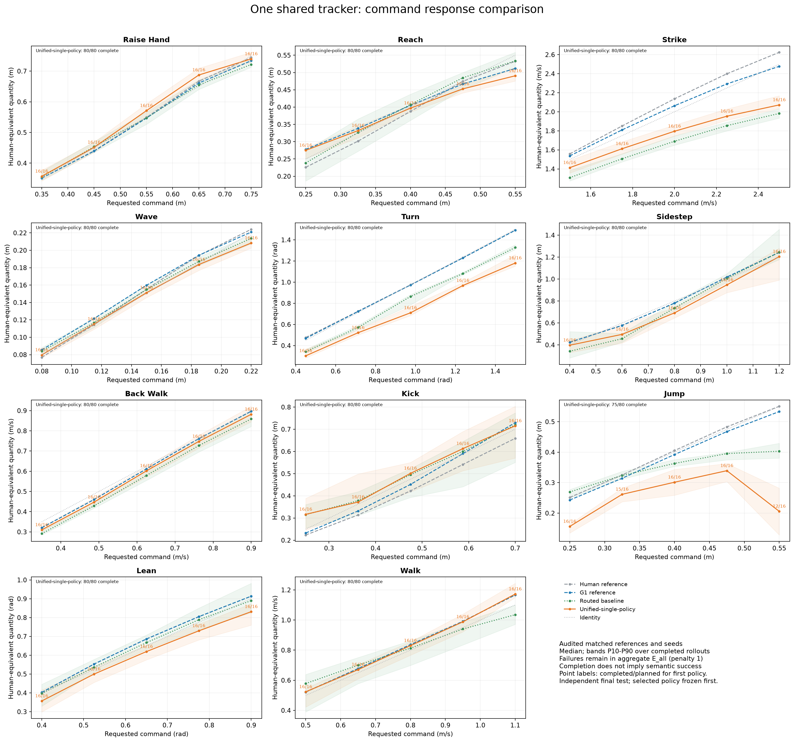

# 统一 G1 tracker：独立测试结果

本轮交付的是一套全动作共用的 tracker：同一观测构造、同一归一化、同一 MLP、同一权重。没有按动作切换 tracker，也没有把上下半身交给两个网络。实现采用 BeyondMimic 的全身策略接口进行多动作联合训练；没有直接平均 SONIC 与 BeyondMimic 的权重。

最终权重由全部 11 类动作的开发集总体误差选择：`joint_v5_root_short_validation`。独立测试使用 880 条新噪声样本，在权重冻结后生成。

| 方案 | 全程完成 | 动作语义通过 | 语义与参数精度同时通过 | 宏平均 E_all↓ |
|---|---:|---:|---:|---:|
| 统一权重 | 875/880 | 837/880 | 420/880 | 0.1693 |
| 冻结的混合方案 | 876/880 | 847/880 | 421/880 | 0.1519 |

统一减混合的 E_all 差值为 0.0174，配对 prompt/noise-block bootstrap 的 95% 区间为 [0.0058, 0.0292]。重采样将同一提示编号/噪声编号对应的全部十一类动作和五档命令保留在同一个块内；该区间只反映本批输入变化，不代表跨训练种子的不确定性。

E_all 对物理失败或语义失败记 1；其余为绝对命令误差除以命令范围并截断至 1，各任务等权。语义通过使用固定的几何事件规则，与对照相同，并非人工动作质量评分。全程站稳并不等于执行成功：例如没有真正起跳会被语义检查判失败。

图中横轴为命令，纵轴为相应测量量；距离和速度换算为 human-equivalent 单位，角度保留弧度。曲线为完成样本的中位数，色带为 P10–P90，不是置信区间。失败样本保留在总体误差中；每个点标出完成/计划数量。

| 动作 | 统一：完成/语义/联合通过 | 统一 E_all↓ | 混合：完成/语义/联合通过 | 混合 E_all↓ |
|---|---:|---:|---:|---:|
| raise_hand | 80/80/48 | 0.0497 | 80/80/57 | 0.0364 |
| reach | 80/80/40 | 0.0813 | 76/75/32 | 0.1435 |
| strike | 80/80/18 | 0.2207 | 80/80/0 | 0.3294 |
| wave | 80/80/76 | 0.0341 | 80/80/78 | 0.0351 |
| turn | 80/73/0 | 0.2916 | 80/80/1 | 0.1323 |
| sidestep | 80/79/35 | 0.1135 | 80/75/35 | 0.1548 |
| back_walk | 80/78/64 | 0.0812 | 80/67/36 | 0.2335 |
| kick | 80/75/38 | 0.1871 | 80/73/42 | 0.1882 |
| jump | 75/53/2 | 0.6047 | 80/80/41 | 0.1945 |
| lean | 80/80/55 | 0.0968 | 80/77/60 | 0.1060 |
| walk | 80/79/44 | 0.1016 | 80/80/39 | 0.1171 |

每类动作 80 条。上游生成器与 retarget 仍使用冻结 V3 的任务适配方案，本轮只统一 tracker。混合方案与统一策略各自保留原生执行器和动力学配置，因此这是整个执行方案的比较，不能单独归因于网络架构。

## 连续与组合动作

| 测试 | 计划 | 全程完成 | 所有组件语义通过 | 所有组件联合通过 |
|---|---:|---:|---:|---:|
| sequence | 24 | 23 | 21 | 3 |
| composition | 12 | 12 | 8 | 2 |

连续序列覆盖抬手→挥手→前倾、前进→转向→后退、踢腿→跳跃→前伸、侧移→击打→前进。组合参考覆盖走路/后退与右臂挥手。每条完整序列只载入一次权重，内部边界不重置机器人；全部组件通过才记整条通过。该组使用新噪声，但组合形式在增强训练中出现过，不代表未见组合泛化。

## 开发过程与失败实验

| 开发候选 | 完成 | 语义 | 联合通过 | E_all↓ |
|---|---:|---:|---:|---:|
| joint_v1_validation | 90/110 | 63 | 13 | 0.6201 |
| joint_v2_plain_validation | 81/110 | 58 | 15 | 0.5856 |
| joint_v2_preview_validation | 86/110 | 71 | 14 | 0.5587 |
| joint_v3_pose_common_step1000_validation | 103/110 | 61 | 7 | 0.6523 |
| joint_v3_pose_common_validation | 95/110 | 64 | 14 | 0.6011 |
| joint_v4_tracking_step1000_validation | 101/110 | 88 | 30 | 0.3266 |
| joint_v4_tracking_step2000_validation | 108/110 | 95 | 30 | 0.2682 |
| joint_v4_tracking_step3000_validation | 108/110 | 98 | 36 | 0.2528 |
| joint_v4_tracking_step4000_validation | 106/110 | 96 | 50 | 0.2281 |
| joint_v4_tracking_validation | 109/110 | 97 | 34 | 0.2434 |
| joint_v5_root_short_step1000_validation | 106/110 | 98 | 28 | 0.2723 |
| joint_v5_root_short_step2000_validation | 107/110 | 98 | 55 | 0.2051 |
| joint_v5_root_short_step3000_validation | 108/110 | 97 | 46 | 0.2431 |
| joint_v5_root_short_step4000_validation | 110/110 | 105 | 54 | 0.1674 |
| joint_v5_root_short_validation | 109/110 | 107 | 49 | 0.1593 |
| joint_v5_root_long_step1000_validation | 110/110 | 96 | 38 | 0.2669 |
| joint_v5_root_long_step2000_validation | 108/110 | 98 | 50 | 0.2158 |
| joint_v5_root_long_step3000_validation | 108/110 | 97 | 41 | 0.2731 |
| joint_v5_root_long_step4000_validation | 110/110 | 97 | 58 | 0.2155 |
| joint_v5_root_long_validation | 109/110 | 105 | 48 | 0.1747 |

开发集上的多次比较参与了模型选择，不能当作独立测试。普通联合微调曾明显退化；后续加入真实片段终止、训练数据平衡、连续/组合参考、预览归一化校准，以及统一的关节与根部跟踪奖励。短/长预览的配对续训共享同一开发集选出的父权重、训练数据、奖励和随机种子；每种只有一次训练，尚无跨训练种子的统计验证。起初评测第 1000、3000 和最终步；观察到 V4 的学习曲线非单调后，在最终数据生成前对两组对称补齐第 2000、4000 步。该扩展属于开发集探索，不声称最初就预注册了全部搜索。

开发集跳跃诊断显示，retarget 参考保留约 0.20–0.45 米的机器人根部上升和下蹲准备，但 V4 完成样本只执行出约 0.05–0.10 米。该证据定位的是这组跳跃的跟踪损失，不足以证明所有参考动力学可行，也不能说明所有动作都没有 retarget 问题。

转向的开发集姿态分解显示，实际躯干比骨盆多转约 0.09–0.15 rad，参考中只相差约 0.01–0.03 rad。这与腰部补偿部分转向一致，但不是因果消融。后续可在所有动作共用的奖励中加强骨盆全局朝向与躯干相对姿态约束；本轮没有据此修改权重或最终评测。

## 可复查性与限制

- 策略 SHA-256：`72218056174c917a064ccf2c0a15e24601f9ed8df17cded6841be8f73936c217`。
- 导出 actor 输入 361 维、输出 29 维；预览帧偏移 `[5, 10, 20]`，参考频率 50 Hz。
- 最终从保存状态重算指标的最大误差：统一 0，混合 0；未发现接触/约束缓冲区溢出。
- 原始物理轨迹、训练数据和全部检查点保留在服务器 `outputs_amass/franken_unified_20261004`。交付包包含唯一权重、actor 导出、代码、来源清单、审计和响应图。
- 训练/开发/最终噪声种子分离，但文本模板和命令范围重合；不声称任意文本或范围外命令泛化。
- 同一物理 rollout 的指标可以精确重算；不同 GPU rollout 不保证逐位一致。兼容性检查中曾出现约 7e-5 的最大状态差，重复运行也有同量级差异，未改动评测门槛。
- 模型仍需配套的机器人关节顺序、观测顺序、动作缩放和原生控制参数。未执行真机部署，仿真通过不等于硬件可部署。
